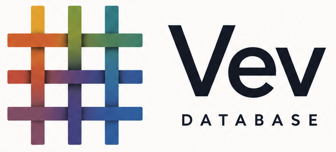

<div align="center">
  
</div>

# VevDB

**A native, embedded Datalog database built around immutable database values.**

VevDB weaves immutable facts into a durable fabric of attributed entities and
values. Facts accumulate through append-only transactions, producing immutable
database snapshots that applications can query declaratively and pass around
as ordinary values.

VevDB provides Datomic-style transactions, Datalog queries, pull expressions,
and snapshot semantics for both in-memory and durable databases. Durable stores
use SQLite internally, while VevDB's indexes and query engine implement the
database model.

The engine is written in [Kvist](https://github.com/kvist-lang/kvist), compiled
to Odin, and exposed through a native C ABI. The repository includes APIs for
Kvist, Clojure, Java, C, Python, Rust, Go, Node.js, and Odin.

## Why VevDB

“Vev” is an excellent metaphor: Norwegian for a loom, weave, or interconnected
fabric, reflecting how the database weaves immutable facts together.

But “Vev” is already used by several software companies, and the package name
is occupied on registries such as npm and PyPI. Using VevDB preserves the
meaning while making the project clearer, more searchable, and easier to
distinguish across documentation, websites, and package ecosystems.

The product is therefore called **VevDB**, while concise technical identifiers
such as `vev.core`, `libvev`, `vev.h`, and `vev_*` remain where useful. The
standalone command is `vevdb`. See [Naming](docs/naming.md) for the canonical
mapping across ecosystems.

## Quick Start

### C

VevDB is an embedded native library with a stable C ABI:

```c
#include <stdio.h>
#include "vev.h"

int main(void) {
    vev_conn_t conn = vev_conn_open_memory();                       // 1

    vev_string_free(vev_transact_edn(                               // 2
        conn, "[{:db/id 1 :user/name \"Ada\"}]"));

    const char *rows = vev_query_edn(                               // 3
        conn, "[:find ?name :where [?e :user/name ?name]]");
    puts(rows);

    vev_string_free(rows);
    vev_conn_close(conn);                                           // 4
}
```

1. The process embeds an in-memory VevDB connection.
2. Transactions cross the ABI as EDN data.
3. Queries return EDN; typed result and prepared-query APIs are also available.
4. The caller owns native handles and returned strings.

### Kvist

Kvist uses VevDB directly as a source package, with transactions and Datalog
written as native data:

```clojure
(package main)

(import data "kvist:data")
(import fmt "core:fmt")
(import d "../../src/vev_app")

(defn main []
  (let [conn (d.create-conn)
        _ (d.transact conn                        ; 1
            [{:db/id 1 :user/name "Ada"}])
        db (d.db conn)                            ; 2
        names (d.q                                ; 3
                '[:find ?name
                  :where [?e :user/name ?name]]
                db)]
    (for [[name] names]                           ; 4
      (fmt.println (data.string name)))))
```

1. Transaction maps are Kvist data, not encoded text.
2. `db` returns the connection's current immutable database value.
3. Static Datalog stays quoted because its symbols are literal query data.
4. Query relations are `Data`; rows can be iterated and destructured directly.

This minimal program exits immediately. Long-running applications close owning
DB values and connections with `d.close`; immutable `Data` query results are
managed values. The complete contact book below demonstrates those lifetimes.

### Clojure

The Clojure API follows the familiar Datomic connection, database value, and
query shape:

```clojure
(require '[vev.core :as d])

(def conn (d/create-conn)) ; 1

(d/transact conn           ; 2
  [{:db/id 1 :user/name "Ada"}
   {:db/id 2 :user/name "Grace"}])

(def db (d/db conn))       ; 3

(d/q '[:find ?name         ; 4
       :where [?e :user/name ?name]]
     db)

(def next-db               ; 5
  (d/db-with db [{:db/id 3 :user/name "Katherine"}]))
```

1. `create-conn` creates an in-memory database connection.
2. `transact` adds facts and advances the connection to a new database value.
3. `db` returns the connection's current immutable database value.
4. `q` evaluates a Datalog query against an explicit database value.
5. `db-with` creates a hypothetical database value without changing `conn` or
   `db`.

Use `connect` when the database should persist to a VevDB store:

```clojure
(def conn (d/connect "app.vev"))
```

The application still uses VevDB transactions and queries. It does not create
SQLite tables, run migrations, or issue SQL.

### Java

Java 21 uses the Foreign Function and Memory API through an `AutoCloseable`
wrapper:

```java
Vev vev = Vev.load();

try (var conn = vev.createConn()) {
    conn.transact("[{:db/id 1 :user/name \"Ada\"}]");
    System.out.println(conn.queryText(
        "[:find ?name :where [?e :user/name ?name]]", "[]"));
}
```

### Python

Python uses EDN text at the language boundary and context managers for native
handle lifetimes:

```python
import vevdb

with vevdb.create_conn() as conn:                                  # 1
    conn.transact('[{:db/id 1 :user/name "Ada"}]')                 # 2
    with conn.db() as db:                                          # 3
        rows = vevdb.q(
            '[:find ?name :where [?e :user/name ?name]]', db)      # 4
        profile = db.pull('[:user/name]', vevdb.Entity(1))
```

1. The context manager closes the native connection.
2. Transaction data is passed as EDN text through the native API.
3. The DB handle represents an immutable snapshot and has its own lifetime.
4. Queries receive the immutable DB value explicitly.

### Rust

Rust wraps the same native handles with RAII:

```rust
use vevdb::Conn;

fn main() -> Result<(), String> {
    let conn = Conn::open_memory()?;                                // 1
    conn.transact(r#"[{:db/id 1 :user/name "Ada"}]"#);             // 2

    let db = conn.db()?;                                            // 3
    let rows = db.q(
        "[:find ?name :where [?e :user/name ?name]]", "[]")?;      // 4

    println!("{rows:?}");
    Ok(())
}
```

1. `Conn` owns and releases the native connection.
2. Transactions use EDN text at the C ABI boundary.
3. `Db` owns an immutable database snapshot and releases it through `Drop`.
4. Query inputs are encoded separately from the query itself.

### Go

Go provides a cgo wrapper over the native library:

```go
conn, err := vev.CreateConn()
if err != nil {
    panic(err)
}
defer conn.Close()

conn.Transact(`[{:db/id 1 :user/name "Ada"}]`)
fmt.Println(conn.QueryText(
    `[:find ?name :where [?e :user/name ?name]]`, `[]`))
```

### Node.js

Node.js and TypeScript use the native N-API addon:

```javascript
const vev = require("vev");
const conn = vev.createConn();

try {
  conn.transact('[{:db/id 1 :user/name "Ada"}]');
  console.log(vev.q(
    '[:find ?name :where [?e :user/name ?name]]', conn));
} finally {
  conn.close();
}
```

### Odin

Odin can bind the C ABI directly:

```odin
import "core:fmt"

foreign import vev "system:vev"

foreign vev {
    vev_conn_open_memory :: proc "c" () -> rawptr ---
    vev_conn_close       :: proc "c" (conn: rawptr) ---
    vev_transact_edn     :: proc "c" (conn: rawptr, tx: cstring) -> cstring ---
    vev_query_edn        :: proc "c" (conn: rawptr, query: cstring) -> cstring ---
    vev_string_free      :: proc "c" (text: cstring) ---
}

main :: proc() {
    conn := vev_conn_open_memory()
    defer vev_conn_close(conn)
    vev_string_free(vev_transact_edn(
        conn, `[{:db/id 1 :user/name "Ada"}]`))

    rows := vev_query_edn(
        conn, `[:find ?name :where [?e :user/name ?name]]`)
    defer vev_string_free(rows)
    fmt.println(string(rows))
}
```

Complete in-memory and durable examples are available in
[`examples/clojure/contact_book.clj`](examples/clojure/contact_book.clj) and
[`examples/kvist/contact_book.kvist`](examples/kvist/contact_book.kvist). The
client directories contain complete host-specific examples and package checks
for every supported language.

## Database Model

VevDB stores facts as datoms consisting of entity, attribute, value,
transaction, and added/retracted fields.

- Transactions add and retract facts.
- Connections advance to new database values when transactions commit.
- Existing database values remain stable and queryable.
- Queries are data and accept explicit database values and other inputs.
- Pull expressions render entity data declaratively.
- In-memory and durable connections expose the same database-value model.

VevDB follows Datomic and DataScript syntax and semantics where they apply to an
embedded native database. This includes transaction maps and operation vectors,
schema attributes, lookup refs, pull patterns, query inputs, predicates,
aggregates, rules, and immutable `db-with` operations.

## Capabilities

- In-memory databases with no SQLite requirement.
- Durable local stores backed internally by SQLite.
- Immutable database snapshots and hypothetical `db-with` values.
- EAVT, AEVT, AVET, and VAET indexes with range and seek operations.
- Datomic-flavored Datalog with predicates, functions, aggregates, rules,
  negation, disjunction, relation inputs, and pull expressions.
- Datomic-shaped transaction data, schema constraints, tempids, lookup refs,
  upserts, tuple attributes, transaction functions, and transaction reports.
- Prepared query, pull, and transaction APIs for native hosts.
- A C header and language wrappers over the native ABI.
- A CLI for querying, transacting, pulling, and inspecting durable stores.

## Build And Verify

Building VevDB from source requires Kvist, Odin, Clang, and an archiver. The
build downloads and checksum-verifies a pinned SQLite amalgamation, then links
it statically; users do not install SQLite separately. The normal `kvist`
command should point to a built Kvist compiler.

Build the native and JVM artifacts and produce the release manifest:

```sh
scripts/build_release.sh
```

Run the parallel Clojure and Kvist contact-book applications:

```sh
scripts/contact_book.sh
```

Run the available host-language and package checks:

```sh
scripts/smoke_clients.sh
scripts/smoke_cli.sh
scripts/smoke_packages.sh
```

See [Getting Started](docs/getting-started.md) for local setup and complete
examples. See [Runtime Dependencies](docs/runtime-dependencies.md) for native
library and SQLite deployment details.

## Language APIs

| Host | API |
| --- | --- |
| Kvist | [`src/vev_app`](src/vev_app) |
| Clojure | [`vevdb/vev-clj`](https://github.com/vevdb/vev-clj) |
| Java | [`vevdb/vev-java`](https://github.com/vevdb/vev-java) |
| C | [`include/vev.h`](include/vev.h) and [`clients/c`](clients/c) |
| Python | [`clients/python`](clients/python) |
| Rust | [`clients/rust`](clients/rust) |
| Go | [`clients/go`](clients/go) |
| Node.js / TypeScript | [`clients/node`](clients/node) |
| Odin | [`clients/odin`](clients/odin) |

## Documentation

- [Getting started](docs/getting-started.md)
- [Database model](docs/data-model.md)
- [Transactions](docs/transactions.md)
- [Query model](docs/query-model.md)
- [Pull](docs/pull-model.md)
- [Indexes](docs/indexes.md)
- [Durable storage](docs/storage.md)
- [C ABI](docs/c-abi.md)
- [Language interop](docs/interop.md)
- [MusicBrainz and Day of Datomic](docs/musicbrainz.md)

## Acknowledgements

VevDB would not have been possible without
[Datomic](https://www.datomic.com/) and its articulation of datoms,
transactions, immutable database values, and Datalog as a coherent programming
model.

[DataScript](https://github.com/tonsky/datascript) made that model available in
a compact open-source implementation. Its behavior and test suite provide
VevDB's primary semantic compatibility reference.

[Datalevin](https://github.com/datalevin/datalevin) demonstrates how the same
ideas can support a fast, durable database. Its query, indexing, storage, and
benchmark work has been indispensable when shaping VevDB's native engine.

[Day of Datomic](https://github.com/Datomic/day-of-datomic) and the Datomic
MusicBrainz sample turn the model into concrete, realistic exercises. They
provide VevDB with a practical standard for tutorial compatibility, correctness,
and performance.

VevDB is deeply grateful to the authors and contributors of all four projects.
Copied or adapted open-source material remains under its original copyright
and license terms.

## License

VevDB is licensed under the Eclipse Public License 2.0. See [LICENSE](LICENSE).
