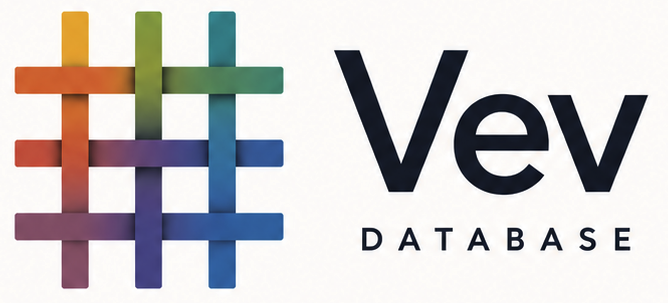

<div align="center">
  
</div>

# VevDB

**A native, embedded Datalog database built around immutable database values.**

[Website](https://vevdb.com/) · [Documentation](https://vevdb.com/docs/)

VevDB weaves immutable facts into a durable fabric of attributed entities and
values. Facts accumulate through append-only transactions, producing immutable
database snapshots that applications can query declaratively and pass around
as ordinary values.

VevDB provides Datomic-style transactions, Datalog queries, pull expressions,
and snapshot semantics for both in-memory and durable databases. Durable stores
use SQLite internally, while VevDB's indexes and query engine implement the
database model.

VevDB is for applications that want this model without a separate Datomic
transactor process. It runs in-process as a lightweight native library, either
in memory or durably with bundled SQLite. It does not require a Clojure runtime
or a large GraalVM native image.

VevDB follows Datomic's data model and much of its familiar API. Datomic
tutorials about transactions, queries, pull, entities, indexes, history, and
immutable database values carry over with small changes for setup and
synchronous calls.

The engine is written in [Kvist](https://github.com/kvist-lang/kvist) and
compiles through Odin to a native library. Clojure and Kvist are the paired
primary APIs, backed by the C ABI. Java, Odin, Python, Rust, Go, and Node.js
packages adapt to their host languages and may expose different surfaces.

## Quick Start

### C: native API

```c
#include <stdio.h>
#include "vev.h"

int main(void) {
    vev_conn_t conn = vev_conn_open_memory();

    vev_string_free(vev_transact_edn(
        conn, "[{:db/id 1 :user/name \"Ada\"}]"));

    const char *rows = vev_query_edn(
        conn, "[:find ?name :where [?e :user/name ?name]]");
    puts(rows);

    vev_string_free(rows);
    vev_conn_close(conn);
}
```

The [C ABI guide](docs/c-abi.md) covers builds, ownership, typed values, and
prepared operations.

### Clojure: familiar data API

Add the package:

```clojure
{:deps {com.vevdb/vev-clj {:mvn/version "0.4.0"}}}
```

Use `vev.core`, conventionally aliased as `d`:

```clojure
(require '[vev.core :as d])

(def conn (d/create-conn))

(d/transact conn
  [{:db/id 1 :user/name "Ada"}
   {:db/id 2 :user/name "Grace"}])

(def db (d/db conn))

(d/q '[:find ?name
       :where [?e :user/name ?name]]
     db)

(def next-db
  (d/db-with db [{:db/id 3 :user/name "Katherine"}]))
```

`db` and `next-db` are immutable values. `db-with` does not change `conn`.
Use `(d/connect "example.db")` for a durable store, replacing `example.db`
with the path you want.

See [vev-clj](https://github.com/vevdb/vev-clj) for installation and the full
Clojure API.

## CLI

The CLI reads and writes durable stores without a separate server:

```sh
vevdb transact example.db transactions.edn
vevdb query example.db query.edn
```

EDN can be passed inline or in `.edn` files. Download the CLI from a
[VevDB release](https://github.com/vevdb/vev/releases) and see the
[CLI guide](docs/cli.md) for all commands.

## Packages

| Language | Status | Package |
| --- | --- | --- |
| C | Built in | [Header](include/vev.h) |
| Kvist | Built in | [API](clients/kvist) |
| Clojure | Available | [vevdb/vev-clj](https://github.com/vevdb/vev-clj) |
| Java | Available | [vevdb/vev-java](https://github.com/vevdb/vev-java) |
| Odin | Available | [vevdb/vev-odin](https://github.com/vevdb/vev-odin) |
| Python | In progress | [Integration code](clients/python) |
| Rust | In progress | [Integration code](clients/rust) |
| Go | In progress | [Integration code](clients/go) |
| Node.js / TypeScript | In progress | [Integration code](clients/node) |

In-progress clients are experimental and not published. They remain here as
integration tests until they move to standalone repositories.

See [Packages](docs/interop.md) for package details and
[Runtime dependencies](docs/runtime-dependencies.md) for deployment.

## Model

A datom is a five-part fact:

```text
entity attribute value transaction added?
```

Transactions produce new database values. Existing values stay valid. Queries,
pull, entity reads, index reads, `as-of`, `since`, `history`, and `db-with`
operate on explicit database values.

Durable stores use SQLite internally. Applications use VevDB APIs and do not
manage SQL schemas.

## Features

- In-memory and durable databases
- Immutable snapshots and hypothetical databases
- Data-oriented transactions, schema, tempids, lookup refs, and upserts
- Datalog queries with inputs, predicates, aggregates, rules, negation, and
  disjunction
- Pull and entity reads
- EAVT, AEVT, AVET, and VAET indexes
- Historical views and transaction logs
- C ABI, CLI, and language packages

## Direct SQLite

VevDB provides direct access to its bundled SQLite for separate application
databases. This does not expose or modify the VevDB store. See the
[Direct SQLite guide](docs/sqlite.md).

## Documentation

- [Getting started](docs/getting-started.md)
- [CLI](docs/cli.md)
- [Build from source](docs/building.md)
- [Data model](docs/data-model.md)
- [Transactions](docs/transactions.md)
- [Queries and pull](docs/query-model.md)
- [History](docs/history.md)
- [Storage](docs/storage.md)
- [SQLite for application data](docs/sqlite.md)
- [Datomic and VevDB](docs/datomic-syntax.md)
- [C ABI](docs/c-abi.md)
- [Packages](docs/interop.md)
- [Runtime dependencies](docs/runtime-dependencies.md)
- [Benchmarks](docs/benchmarks.md)
- [MusicBrainz validation](docs/musicbrainz.md)

## Acknowledgements

VevDB would not have been possible without
[Datomic](https://www.datomic.com/) and its articulation of datoms,
transactions, immutable database values, and Datalog as a coherent programming
model.

[DataScript](https://github.com/tonsky/datascript) made that model available in
a compact open-source implementation. Its behavior and test suite provide
VevDB's primary semantic compatibility reference.

[Datalevin](https://github.com/datalevin/datalevin) demonstrates how the same
ideas can support a fast, durable database. Its query, indexing, storage, and
benchmark work has been indispensable when shaping VevDB's native engine.

[Day of Datomic](https://github.com/Datomic/day-of-datomic) and the Datomic
MusicBrainz sample turn the model into concrete, realistic exercises. They
provide VevDB with a practical standard for tutorial compatibility, correctness,
and performance.

VevDB is deeply grateful to the authors and contributors of all four projects.
Copied or adapted open-source material remains under its original copyright
and license terms.

## License

[Eclipse Public License 2.0](LICENSE)
